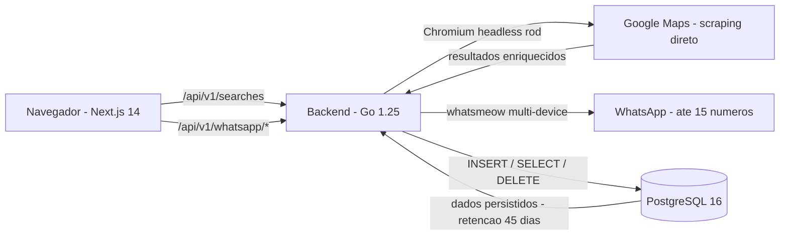

# Clicars Search

**Descubra empresas por nicho e localização em segundos.**

O Clicars Search usa um **scraper próprio do Google Maps** (Chromium headless via [rod](https://github.com/go-rod/rod), **sem API key**) com um backend em Go e um dashboard Next.js para entregar listas de empresas — com nome, telefone e site — prontas para prospecção, sem nenhuma configuração manual.

---

## Arquitetura



```
.
├── docker-compose.yml          # Orquestra db + api + frontend
├── .env.example                # Variáveis de ambiente (copie para .env)
├── db/
│   └── init.sql                # Schema: searches, companies, whatsapp_sessions
├── backend/                    # API Go (Clean Architecture)
│   ├── Dockerfile
│   ├── cmd/api/main.go         # Ponto de entrada, graceful shutdown
│   └── internal/
│       ├── domain/             # Entidades: Search, Company, WhatsAppSession, Campaign
│       ├── usecase/            # PerformSearch (regras de negócio)
│       ├── repository/         # Google Maps scraper + PostgreSQL (searches, whatsapp, campaigns)
│       ├── campaign/           # Dispatch anti-ban (delay + rate limit + validação)
│       ├── whatsapp/           # SessionManager multi-device (whatsmeow)
│       └── delivery/http/      # Handlers: /api/v1/searches + /whatsapp + /campaigns
└── frontend/                   # Dashboard Next.js
    ├── Dockerfile
    └── src/
        ├── components/Nav.tsx          # Abas Busca / WhatsApp
        └── app/
            ├── page.tsx                # UI de busca + tabela de resultados
            └── whatsapp/page.tsx       # Painel: grid de 15 slots + QR Code
```

---

## Tecnologias

| Camada     | Tecnologia                       |
|------------|----------------------------------|
| Backend    | Go 1.25 · Clean Architecture     |
| Frontend   | Next.js 14 · React 18 · Tailwind |
| Banco      | PostgreSQL 16                    |
| Busca/Scrape | Google Maps via rod (Chromium headless) — sem API key |
| WhatsApp   | whatsmeow (multi-device)         |
| Container  | Docker / Docker Compose          |

---

## Como rodar

### Pré-requisitos

- [Docker](https://docs.docker.com/get-docker/) ≥ 24
- [Docker Compose](https://docs.docker.com/compose/) ≥ 2 (já incluso no Docker Desktop)
- **Nenhuma API key** — o scraping do Google Maps roda com um Chromium headless embutido na imagem do backend.

> **Windows:** o **Docker Desktop precisa estar aberto e rodando** antes de subir o
> projeto. Se você ver `failed to connect to the docker API at npipe:////./pipe/...`
> ou `Cannot connect to the Docker daemon`, é só isso — abra o Docker Desktop,
> espere a baleia ficar verde e rode o `docker compose up` de novo.

### Passo a passo

```bash
# 1. Clone o repositório
git clone <repo-url>
cd "Clicars Search"

# 2. Configure as variáveis de ambiente
cp .env.example .env
# Os valores padrão já funcionam para rodar localmente.

# 3. Suba todos os serviços (Docker Desktop precisa estar aberto)
docker compose up -d --build

# 4. Verifique se a API está saudável
curl http://localhost:8080/health
# {"status":"ok"}

# 5. Abra o dashboard no navegador
# http://localhost:3000
```

O banco sobe primeiro (aguarda o healthcheck do Postgres), a API conecta em seguida e o frontend serve na porta 3000.

> **Dimensionamento (importante para máquina local):** cada busca abre instâncias de
> Chromium headless. Os padrões do `.env` (`GOOGLEMAPS_BROWSER_POOL=3`,
> `GOOGLEMAPS_CONCURRENCY=10`) são pensados para um notebook/desktop. Valores altos
> (ex.: `30` / `300`) sobem dezenas de browsers e podem **estourar a RAM** e derrubar
> o container `api` por OOM — use-os só em servidor dedicado.

---

## Variáveis de ambiente

Crie `.env` na raiz (ou exporte as variáveis no shell). Veja `.env.example` para o template completo.

| Variável                    | Padrão                  | Descrição                                                      |
|-----------------------------|-------------------------|----------------------------------------------------------------|
| `POSTGRES_USER`             | `clicars`               | Usuário do banco                                               |
| `POSTGRES_PASSWORD`         | `clicars_pass`          | Senha do banco                                                 |
| `POSTGRES_DB`               | `clicars_search`        | Nome do banco                                                  |
| `GOOGLEMAPS_BROWSER_POOL`   | `3`                     | Instâncias de Chromium headless em paralelo (suba em servidor) |
| `GOOGLEMAPS_CONCURRENCY`    | `10`                    | Goroutines de enrichment simultâneas                          |
| `GOOGLEMAPS_SCROLL_TIMEOUT` | `30s`                   | Timeout por scroll no painel de resultados do Maps            |
| `NEXT_PUBLIC_API_URL`       | `http://localhost:8080` | URL da API chamada pelo navegador — sobrescreva em produção    |

---

## API

### `GET /health`

```
200 OK  →  {"status":"ok"}
```

### `GET /api/v1/searches`

Retorna as últimas 20 buscas realizadas (apenas metadados), da mais recente para a mais antiga.

**Resposta `200 OK`**

```json
[
  {
    "id":         "b3f1c2a4-5d6e-7f80-91a2-b3c4d5e6f708",
    "niche":      "concessionárias de veículos seminovos",
    "location":   "São Paulo, Brasil",
    "quantity":   5,
    "created_at": "2026-06-15T12:34:56Z"
  }
]
```

---

### `GET /api/v1/searches/{id}`

Retorna os detalhes de uma busca específica e a lista completa de empresas associadas.

**Resposta `200 OK`** — mesmo formato de `POST /api/v1/searches` (`search_id`, `niche`, `location`, `quantity`, `created_at`, `companies[]`).

**Resposta `404 Not Found`** — quando nenhuma busca existe com o `id` informado.

---

### `POST /api/v1/searches`

Executa uma busca de empresas via scraping do Google Maps, persiste o resultado (busca + empresas) no PostgreSQL e retorna tudo em uma única resposta.

**Request**

```json
{
  "niche":    "concessionárias de veículos seminovos",
  "location": "São Paulo, Brasil",
  "quantity": 5
}
```

| Campo      | Tipo   | Regras                        |
|------------|--------|-------------------------------|
| `niche`    | string | obrigatório                   |
| `location` | string | obrigatório                   |
| `quantity` | int    | obrigatório, entre `1` e `5000` |

**Exemplo (cURL)**

```bash
curl -X POST http://localhost:8080/api/v1/searches \
  -H "Content-Type: application/json" \
  -d '{"niche":"concessionárias de veículos seminovos","location":"São Paulo, Brasil","quantity":5}'
```

**Resposta `201 Created`**

```json
{
  "search_id": "b3f1c2a4-5d6e-7f80-91a2-b3c4d5e6f708",
  "niche":     "concessionárias de veículos seminovos",
  "location":  "São Paulo, Brasil",
  "quantity":  5,
  "created_at": "2026-06-15T12:34:56Z",
  "companies": [
    {
      "id":         "11111111-2222-3333-4444-555555555555",
      "search_id":  "b3f1c2a4-5d6e-7f80-91a2-b3c4d5e6f708",
      "name":       "Auto Center Exemplo",
      "location":   "São Paulo, Brasil",
      "phone":      "+55 11 4002-8922",
      "website":    "https://exemplo.com.br",
      "created_at": "2026-06-15T12:34:56Z"
    }
  ]
}
```

**Códigos de status**

| Status | Quando                                                       |
|--------|--------------------------------------------------------------|
| `201`  | Busca executada e persistida com sucesso                     |
| `400`  | Payload inválido (JSON malformado ou campos faltando/errados)|
| `502`  | Falha ao executar o scraping do Google Maps                  |
| `500`  | Falha ao persistir no banco                                  |

---

## WhatsApp (multi-dispositivo)

Conecte até **15 números** simultâneos via QR Code. A biblioteca **whatsmeow**
(`go.mau.fi/whatsmeow`) gerencia o material de sessão de cada dispositivo nas suas
próprias tabelas (`whatsmeow_*`, criadas no boot); a tabela `whatsapp_sessions`
guarda apenas os metadados da aplicação (número, status, e o JID em `session_data`).

### `GET /api/v1/whatsapp/connect`

Inicia o pareamento e retorna o QR Code como PNG em base64 (pronto para ``).
O pareamento conclui de forma assíncrona — faça _polling_ em `GET …/sessions` até o
novo número aparecer como `CONNECTED`.

```
200 OK      → { "session_id": "7d2c2af9-…", "qr_code": "data:image/png;base64,iVBORw0KGgo…" }
409 Conflict → limite de 15 números atingido
502 Bad Gateway → não foi possível gerar o QR Code
```

### `GET /api/v1/whatsapp/sessions`

Lista todos os números e o status ao vivo (`CONNECTED` / `CONNECTING` / `DISCONNECTED`).

```json
[ { "id": "…", "jid": "…", "phone_number": "5511…", "status": "CONNECTED", "created_at": "…" } ]
```

### `DELETE /api/v1/whatsapp/sessions/{id}`

Desconecta o número (logout no WhatsApp) e remove o registro. `204 No Content` em
caso de sucesso, `404 Not Found` se o `id` não existir.

Sessões `CONNECTED` são **reconectadas automaticamente** no startup; sessões
`DISCONNECTED` com mais de 45 dias são removidas pelo worker de retenção.

---

## Banco de dados

O script `db/init.sql` cria as tabelas `searches`, `companies` e `whatsapp_sessions`
na primeira inicialização do container do Postgres. As tabelas `whatsmeow_*`
(material de sessão dos dispositivos) são criadas em tempo de execução pelo
`container.Upgrade()` do whatsmeow.

**Retenção de dados:** o serviço Go inicia automaticamente um worker de retenção (goroutine) que roda a cada **24 horas** e apaga buscas com mais de **45 dias**:

```sql
DELETE FROM searches WHERE created_at < NOW() - ($1::integer * INTERVAL '1 day')
```

As empresas são removidas em cascata via `ON DELETE CASCADE` (definido no schema). O worker loga a contagem de registros apagados para fins de auditoria:

```
retention worker: started (45-day policy)
retention worker: removed 12 searches older than 45 days
```

O worker para graciosamente junto com o servidor no shutdown.

---

## Testes

O projeto tem testes automatizados no backend (Go) e no frontend (Next.js).

> **Sem Go instalado?** Rode os testes do backend dentro de um container (mesma
> base do build), montando a pasta `backend/`:
>
> ```bash
> docker run --rm -v "$PWD/backend":/app -w /app golang:1.25-alpine go test ./...
> ```

### Backend (Go)

```bash
cd backend

# Testes unitários (usecase + repository + delivery/http).
# O scraping do Google Maps é mockado nos testes — nenhum browser real é aberto.
go test ./...

# Testes de integração do Postgres (precisam do banco do compose no ar):
docker compose up -d db
go test -tags=integration ./internal/repository/...
# A conexão pode ser sobrescrita via TEST_DATABASE_URL.
```

Cobertura:

- **`internal/usecase`** — regras de negócio do fluxo de busca: validação de
  entrada, retornos vazios e erros do provider/persistência (com mocks das portas).
- **`internal/repository`** — scraper do Google Maps (parsing/normalização, degradação
  graciosa) com mocks; e persistência real no Postgres (integração).
- **`internal/delivery/http`** — contrato de `POST /api/v1/searches` (status `201`, UUID, `companies` não-nulo, mapeamento de erros `400/502/500/405`) e de `GET /api/v1/searches` / `GET /api/v1/searches/{id}` (listagem, não-encontrado `404`).

### API ponta a ponta (manual)

Com o stack no ar (`docker compose up -d`), use o arquivo [`api.http`](./api.http)
(extensão *REST Client* do VS Code / *HTTP Client* do IntelliJ) ou cURL:

```bash
curl -X POST http://localhost:8080/api/v1/searches \
  -H "Content-Type: application/json" \
  -d '{"niche":"padarias","location":"São Paulo","quantity":3}'
# -> 201, { "search_id": "<uuid>", "companies": [ ... ] }
```

### Frontend (Next.js)

```bash
cd frontend
npm install   # primeira vez
npm test      # Jest + React Testing Library
```

Os testes (`src/app/page.test.tsx`) verificam que o formulário de busca renderiza e
que o botão exibe o estado de *loading* ("Buscando...") ao ser submetido.

---

## Comandos úteis

```bash
# Logs de todos os serviços
docker compose logs -f

# Logs só da API
docker compose logs -f api

# Rebuild após mudanças no código
docker compose up -d --build

# Parar sem apagar dados
docker compose down

# Parar e apagar tudo (incluindo volume do banco)
docker compose down -v
```

---

## Licença

MIT — veja [LICENSE](./LICENSE).
